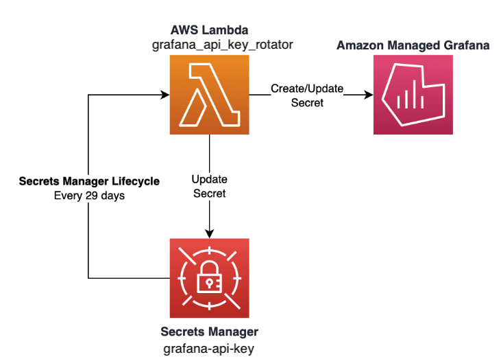

<h1 align="center">Flight Controller AWS Infrastructure</h1>

Terraform CDK code for Flight Controller's AWS infrastructure

## Architecture

## Development

### Deploying a change

- Assume the correct AWS account/refresh credentials
- Synth, plan and deploy both infra & Grafana Dashboard.
  - `make build`
  - `make plan`
  - `make deploy`

### Make Commands

- `make build-python` build all the lambda requirements and store in `infrastructure/all_files`
- `make clean` remove the cdktf.out file.
- `make synth-core` cdktf synth the core infrastructure
- `make synth-grafana` cdktf synth the grafana infrastructure
- `make synth` cdktf both grafana and core infrastructure
- `make build` build python and synth
- `make plan-core` cdktf plan the core infrastructure
- `make plan-grafana` cdktf plan the grafana infrastructure
- `make plan` cdktf both grafana and core infrastructure
- `make deploy` build python and deploy both grafana and core infrastructure
- `make destroy-core` cdktf destroy the core infrastructure
- `make destroy-grafana` cdktf destroy the grafana infrastructure
- `make destroy` cdktf destroy both grafana and core infrastructure

### Managing Grafana API Keys

While writing this, Grafana API Keys are valid for maximum 30 days only. 
Hopefully, Amazon will address this limitation in the future - but in the meantime, this simple pattern can be used to automatically rotate an API key every 29 days and store it for use in AWS Secrets Manager.

The solution is made up of two components:

1. AWS Secret is created with a rotation lifecycle policy that will trigger a Lambda function every 29 days
2. AWS Lambda Function that will create a new API key in Amazon Managed Grafana and update the AWS Secret with the new key

Python code handling the rotation is stored  at `src/entrypoint/grafana_lambda.py`. The code expects two input variables to retrieve secret values from AWS Secrets Manager viz. `grafana_api_key_name` and `grafana_workspace_id`. As the name suggest these values are secret names being used as filters.
